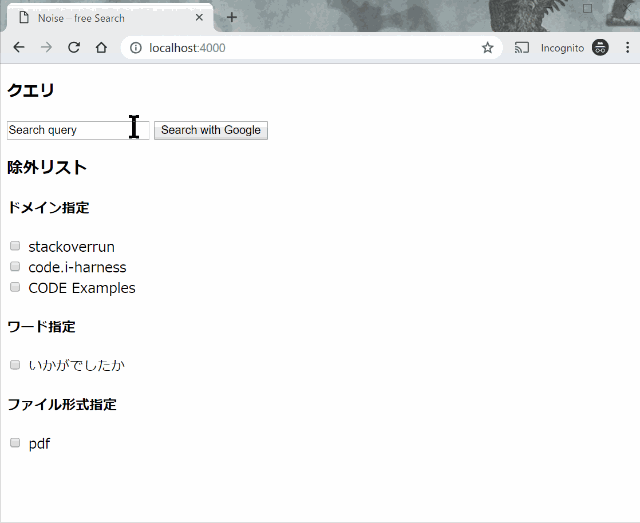

# 機械翻訳のクソサイトとかを除いて検索するためのやつ

以前の履歴 → <https://github.com/pn11/benkyokai/tree/master/web/Vue.js/noise-free-search>

## Usage

### Yarn 導入

#### Ubuntu

`sudo apt install yarn` は別のものが入るのでやらないこと。以下の公式サイト通りにやる。

<https://yarnpkg.com/lang/en/docs/install/#debian-stable>

```bash
curl -sS https://dl.yarnpkg.com/debian/pubkey.gpg | sudo apt-key add -
echo "deb https://dl.yarnpkg.com/debian/ stable main" | sudo tee /etc/apt/sources.list.d/yarn.list
```

```bash
sudo apt-get update && sudo apt-get install yarn
```

Ubuntu 16.04 では yarn を実行するとエラーになることがある。Node.js をアップデートすると治る。

- [Installation Problem: Unexpected token { in cli.js · Issue #6914 · yarnpkg/yarn](https://github.com/yarnpkg/yarn/issues/6914#issuecomment-454124927)

#### Mac

```bash
brew install yarn
```

### Create Project

```bash
mkdir noise-free-search
yarn init
yarn add webpack webpack-dev-server vue vue-loader vue-template-compiler
```

### Start Server

```bash
node_modules/.bin/webpack #webpack でコンパイル
yarn start # http://localhost:4000 にアクセスで見られる。
```



Web フレームワークを初めて使ってみた。

### Deploy on Firebase

```sh
yarn add firebase firebase-tools
node_modules/.bin/firebase login
node_modules/.bin/firebase init
```

で Hosting を選び public directory を `www` に指定する以外はすべて default で OK.

`index.html` に以下を追加。

```html
<!-- The core Firebase JS SDK is always required and must be listed first -->
<script src="/__/firebase/6.1.1/firebase-app.js"></script>
<!-- TODO: Add SDKs for Firebase products that you want to use
    https://firebase.google.com/docs/web/setup#reserved-urls -->
<!-- Initialize Firebase -->
<script src="/__/firebase/init.js"></script>
```

以下でデプロイ。

```sh
firebase deploy --project default
```

デプロイ結果。Webアプリを初めて公開してみた。

- [Noise−free Search](https://noise-free-search.web.app/)
- [Noise−free Search](https://noise-free-search.firebaseapp.com/)

### CI でデプロイ

```sh
firebase login:ci
```

で token が生成されるのでこれを

```sh
firebase deploy --project default --token "GENERATED_TOKEN"
```

のように使えば GitHub Actions などで使える。

## Reference

### yarn, Webpack

- [yarnを使ってVue.jsをwebpackで導入 - TIS ENGINEER NOTE](https://tisnote.com/vue-webpack-yarn/)
- [ゼロからVue向けのウェブパック設定 - Qiita](https://qiita.com/webpack_master/items/80bb0e4d226e1882b377)

### Vue.js

- [リストレンダリング — Vue.js](https://jp.vuejs.org/v2/guide/list.html)
- [コンポーネントの基本 — Vue.js](https://jp.vuejs.org/v2/guide/components.html)
  - これを真似していったらコンポーネントが理解できた。 Vue.js は公式サイトを写経していくのが一番良い勉強方法かも。
- [算出プロパティとウォッチャ — Vue.js](https://jp.vuejs.org/v2/guide/computed.html)

### クソサイトについて

- [Stack Overflowの英語から日本語に機械翻訳されたコンテンツのサイトについてどう思いますか？ - スタック・オーバーフローMeta](https://ja.meta.stackoverflow.com/questions/2905/stack-overflow%E3%81%AE%E8%8B%B1%E8%AA%9E%E3%81%8B%E3%82%89%E6%97%A5%E6%9C%AC%E8%AA%9E%E3%81%AB%E6%A9%9F%E6%A2%B0%E7%BF%BB%E8%A8%B3%E3%81%95%E3%82%8C%E3%81%9F%E3%82%B3%E3%83%B3%E3%83%86%E3%83%B3%E3%83%84%E3%81%AE%E3%82%B5%E3%82%A4%E3%83%88%E3%81%AB%E3%81%A4%E3%81%84%E3%81%A6%E3%81%A9%E3%81%86%E6%80%9D%E3%81%84%E3%81%BE%E3%81%99%E3%81%8B)
- [Сообщения со ссылками на спам–сайты будут блокироваться движком - Stack Overflow на русском Meta](https://ru.meta.stackoverflow.com/questions/7104/%d0%a1%d0%be%d0%be%d0%b1%d1%89%d0%b5%d0%bd%d0%b8%d1%8f-%d1%81%d0%be-%d1%81%d1%81%d1%8b%d0%bb%d0%ba%d0%b0%d0%bc%d0%b8-%d0%bd%d0%b0-%d1%81%d0%bf%d0%b0%d0%bc-%d1%81%d0%b0%d0%b9%d1%82%d1%8b-%d0%b1%d1%83%d0%b4%d1%83%d1%82-%d0%b1%d0%bb%d0%be%d0%ba%d0%b8%d1%80%d0%be%d0%b2%d0%b0%d1%82%d1%8c%d1%81%d1%8f-%d0%b4%d0%b2%d0%b8%d0%b6%d0%ba%d0%be%d0%bc)
- [検索結果から「いかがでしたかブログ」除外　ブラウザ拡張機能「ゴシップサイトブロッカー」が便利 - ねとらぼ](https://nlab.itmedia.co.jp/nl/articles/1903/14/news149.html)
- [Googleの検索結果から機械翻訳でおかしな日本語に翻訳されているQ&Aサイトを非表示にする – Ewig Leere(Lab2)](https://labor.ewigleere.net/2019/04/03/extension-exclude-to-faqservice-from-google-search/)
